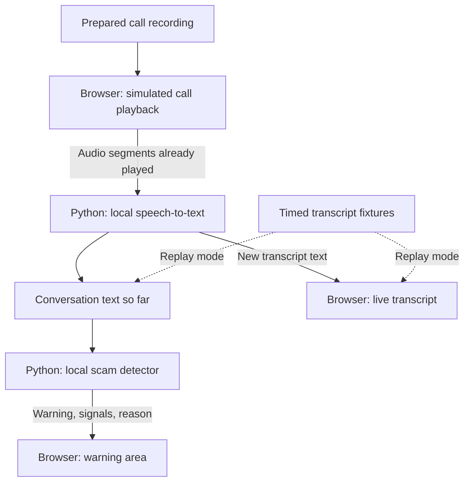

# swissscam

A local scam-call detector that analyses conversations as they unfold and warns users when it detects signs of social engineering. Designed with elderly and vulnerable users in mind.

Built for the Swisscom identity-fraud challenge at the Swiss AI Weeks Zurich Hackathon.

> A minimal mock skeleton is implemented. The sections below describe the target application.

## Run the skeleton

With Python 3.13+ and uv installed:

```sh
uv sync
uv run uvicorn main:app --reload
```

Open http://127.0.0.1:8000 and click **Analyze demo audio**. No API keys are needed.

```text
Prepared audio ID → POST /api/transcribe → fixed transcript
                  → POST /api/analyze    → mock detection result
```

The page can play `data/audio/demo.wav`, a synthetic spoken sample. Playback is optional and not synchronised with analysis yet. The transcription mock checks that the file exists but does not process its audio. The detector warns whenever the text contains “bank” (case-insensitive); this is only a wiring check.

| File | Responsibility |
| --- | --- |
| `main.py` | Serve the page/audio and connect the endpoints. |
| `schemas.py` | Request and response data structures. |
| `transcription.py` | Replace the fixed text with speech recognition here. |
| `detector.py` | Replace the keyword rule with real detection here. |
| `web/index.html` | Small UI and two sequential HTTP requests. |

`POST /api/transcribe` accepts `{"audio_id": "demo"}` and returns `{"text": "..."}`. `POST /api/analyze` accepts `{"transcript": "..."}` and returns `warning`, `signals` and `reason`. Endpoint documentation: http://127.0.0.1:8000/docs.

## app

A browser-based call simulator plays a prepared English recording containing both sides of a conversation. Local speech recognition transcribes the audio incrementally, and a local detector checks the conversation for suspicious requests and manipulation.

The call screen contains a file drop for call recordings, start/end controls, a call timer, a live transcript and a warning area. Warnings explain the concern in plain language:

(here i want to change. it hsould say somethign like this: 
the web app is there to demo the product. it contains two parts:
1 .a regular looking call app screen meant to simlutare a normal phone call app. this is what the user would see. when our app detects a scam a big warning and options are displayed)
2 . what happens behind that. so the transcript of the conversation and the current blocks ml prediction if its a scam, what reason etc.

> **Possible scam**
>
> The caller is pressuring you to share a one-time code.
>
> **End call** · **Continue**

Ending a call stops playback and analysis. Continuing dismisses the warning while analysis remains active. An unflagged call is not labelled “safe”.

## Architecture

One local Python backend serves the browser UI and runs transcription and detection. No database or external inference service is required.



Playback determines how much audio is available for analysis. Segments are processed in order. Each completed transcript segment is appended to the conversation before detection runs. The detector never receives future dialogue or the scenario label.

Each call has its own in-memory state. Ending or restarting a call clears that state and ignores pending results from the previous call.

## Components

| Component | Responsibility |
| --- | --- |
| Frontend | Scenario selection, audio playback, call controls, transcript and warning display. |
| Transcription and integration | Transcribe played audio segments locally, accumulate text, call the detector and return updates to the UI. |
| Detection and data | Analyse partial conversations, identify suspicious signals, provide explanations and evaluate detection quality. |

Speech recognition processes short audio segments. Automatic speaker identification is outside the initial scope; the detector accepts plain conversation text.

Detection looks for patterns such as pressure combined with requests for codes, credentials, money or remote access. A bank greeting or the word “urgent” alone should not trigger a warning.

## Interfaces

The transcription component produces text updates:

```json
{
  "text": "Please read me the code we just sent you.",
  "end_seconds": 24.0
}
```

`end_seconds` marks the end of the processed audio segment in the recording. The integration layer appends `text` to the current conversation and passes that text history to `detect(transcript_history)`.

The detector returns:

```json
{
  "warning": true,
  "signals": ["urgency", "otp_request"],
  "reason": "The caller is pressuring you to share a one-time code."
}
```

When no warning is needed, it returns `warning: false`, an empty signals list and an empty reason. Reasons describe detected signals; the UI does not display an uncalibrated probability.

The initial detector is a small rules baseline behind this interface. A local text classifier can replace or extend it without changing the call screen or transcription flow. Model and library choices remain open.

## Demo modes

- **Audio mode:** the recording plays while local speech recognition generates transcript updates for the detector.
- **Transcript replay mode:** prepared, timed text segments feed the same detector as playback advances. This supports development and provides a fallback when speech recognition is unavailable or too slow.

The active mode is visible in the UI. In both modes, warnings come from the detector rather than preset timestamps. End-to-end latency and model quality remain to be measured on the demo laptop.

## Project layout

```text
main.py           # Local server and call-session coordination
transcription.py  # Audio segments to transcript text
detector.py       # Conversation text to detection result
web/              # Browser UI
data/             # Demo recordings, scripts and training data
evaluation/       # Held-out conversations and evaluation results
```

The skeleton also includes `schemas.py`; the evaluation directory is not created yet. Future demo/test conversations will be kept separate from training data.

## Validation

Evaluate on held-out scam and legitimate calls, including legitimate security calls that sound superficially suspicious. Related scripts and paraphrases stay in the same dataset split.

Report detected scams, false alarms and the first warning time relative to the victim sharing information or agreeing to payment. Audio mode is evaluated separately to capture transcription errors and processing delay.

Consented, labelled internal fraud examples could improve scenario coverage and reduce false alarms. The prototype does not depend on access to Swisscom data.
