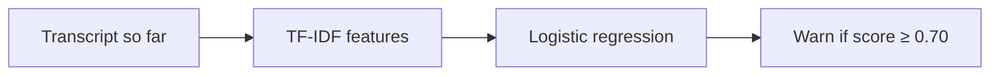

# swissscam

Local scam-call detection for the Swisscom identity-fraud hackathon. The prototype
classifies English conversations, including family impersonation (Enkeltrick),
emergency scams (Schockanruf) and fake police calls.

The demo page and text classifier work. Speech-to-text still returns a fixed mock
transcript; analysis is not yet synchronised with audio playback.

## Run

Requires Python 3.13+ and [uv](https://docs.astral.sh/uv/).

```sh
uv sync
npm install
npm run build
uv run uvicorn main:app --reload
```

Open http://127.0.0.1:8000. The trained model is included; no API key is needed.
Use http://127.0.0.1:8000/docs to submit text to `/api/analyze`.

## ML pipeline

The classifier uses **TF-IDF word and two-word features with logistic regression**.
It receives only the conversation text, without speaker labels or scenario metadata.
The page can play `data/audio/demo.wav`, a synthetic spoken sample. Playback is optional and not synchronised with analysis yet. The transcription mock checks that the file exists but does not process its audio. The detector warns whenever the text contains “bank” (case-insensitive); this is only a wiring check.

| File | Responsibility |
| --- | --- |
| `main.py` | Serve the page/audio and connect the endpoints. |
| `schemas.py` | Request and response data structures. |
| `transcription.py` | Replace the fixed text with speech recognition here. |
| `detector.py` | Replace the keyword rule with real detection here. |
| `web/index.html` | Vite entry document for the React UI. |
| `web/src/main.jsx` | React call monitor and API flow. |

`POST /api/transcribe` accepts `{"audio_id": "demo"}` and returns `{"text": "..."}`. `POST /api/analyze` accepts `{"transcript": "..."}` and returns `warning`, `signals` and `reason`. Endpoint documentation: http://127.0.0.1:8000/docs.

## app

A browser-based call simulator plays a prepared English recording containing both sides of a conversation. Local speech recognition transcribes the audio incrementally, and a local detector checks the conversation for suspicious requests and manipulation.

The call screen contains a file drop for call recordings, start/end controls, a call timer, a live transcript and a warning area. Warnings explain the concern in plain language:

(here i want to change. it hsould say somethign like this: 
the web app is there to demo the product. it contains two parts:
1 .a regular looking call app screen meant to simlutare a normal phone call app. this is what the user would see. when our app detects a scam a big warning and options are displayed)
2 . what happens behind that. so the transcript of the conversation and the current blocks ml prediction if its a scam, what reason etc.

> **Possible scam**
>
> The caller is pressuring you to share a one-time code.
>
> **End call** · **Continue**

Ending a call stops playback and analysis. Continuing dismisses the warning while analysis remains active. An unflagged call is not labelled “safe”.

## Architecture

One local Python backend serves the browser UI and runs transcription and detection. No database or external inference service is required.



### Data and training

All conversations are synthetic. Public data comes from
[BothBosu/scam-dialogue](https://huggingface.co/datasets/BothBosu/scam-dialogue)
under Apache 2.0. The additional scenarios and their labels are assistant-authored.

| Split | Conversations | Purpose |
| --- | ---: | --- |
| Training | 1,551 cleaned public + 240 authored | Learn text patterns |
| Validation | 40 authored | Select the warning threshold |
| Test | 40 authored | Evaluate the finished model |

Related scenario pairs stay in the same split. Authored training calls produce
960 distinct partial transcripts, labelled by whether a warning is justified at
that point. A harmless opening remains negative even if the call later becomes a
scam. Public calls have only whole-call labels, so they are used in full.

Training gives partial transcripts 75% of the weight and public calls 25%, with
equal weight for positive and negative labels within each group. Validation selects
a threshold that balances scam detection and false alarms, counting premature
warnings as errors. The current threshold is **0.70**, not a calibrated probability
of fraud.

### Build and evaluate

```sh
uv run python prepare_data.py                # Clean data and check splits
uv run python train.py                       # Train and select the threshold
uv run python -m unittest -v test_classifier  # Check timing and integration
uv run python evaluate.py                    # Evaluate on test calls
```

The model is saved to `models/scam_classifier.pkl`; results go to `evaluation/`.
`detector.py` loads the model and returns `warning`, an empty `signals` list and a
general explanation. Specific scam tactics are not predicted. Restart the app after
retraining. Only load trusted pickle files.

The current synthetic test detects **19/20 scams**, with **0/20 legitimate calls
flagged** and **no premature warnings**. It misses one fake-police valuables request.
The short verification-code request in the fixed demo transcript is also missed.
This small synthetic test does not establish real-world accuracy. A call without
a warning may still be a scam. Reserve fresh test calls before further tuning.

See [data sources and labels](data/scam/README.md) and
[evaluation details](evaluation/README.md) for the full record.
