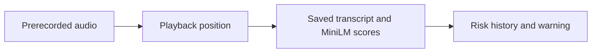

# swissscam

Interactive replay of the Swisscom identity-fraud hackathon prototype.
This branch serves one prerecorded call with saved transcript and model scores.
There are no uploads, live AI inference, Python server or inference API charges.
The original local application is on [`main`](https://github.com/ZellerhoffBen/swissscam/tree/main).

https://github.com/user-attachments/assets/f72413dc-fa74-44a0-893c-ee13847bffc5

## The problem

Scammers impersonate banks, police or relatives to obtain money, credentials or
account access. Fake emergencies make their requests sound urgent and credible.
We flag suspicious conversation content so the person receiving the call can
stop and verify the caller.

## How the website works



The transcript and scores were generated once using the original Whisper and
MiniLM pipeline. The browser reveals each result when playback reaches its timestamp.
The page labels this as a prerecorded demo, not live analysis. Warnings leave the
recording running; visitors can dismiss them, hang up or replay the call.

## Run locally

Requires Node.js 22.12+.

```sh
npm ci
npm run dev
```

Open the address printed by Vite. Tap the phone notification, then **Accept**.

To preview the production build:

```sh
npm run build
npm run preview
```

## Deploy on Vercel

Import this repository, select the `feature/demo-website` branch and keep the
repository root as the Root Directory. `vercel.json` sets the Vite preset,
`npm run build` command and `web/dist` output directory. No environment variables,
Python runtime or paid integrations are needed. For a permanent public link, set
this branch as the project's production branch and make that deployment public.

The same `web/dist` folder can be served by another static host.

## Refresh the saved demo

Only needed when changing the recording or model. Requires the local Python setup:

```sh
uv sync --locked
uv run python -m ml.export_demo
```

This transcribes `data/audio/possible_scam.m4a`, scores the accumulating transcript
and writes `web/src/demo.js` plus the audio in `web/public/demo/`. The export records
audio and model hashes. These files are committed so website builds need only Node.js.

## Original model

MiniLM was fine-tuned on 272 synthetic conversations, expanded into 1,088 partial
transcripts, plus 56 behavior examples. All were AI-authored and labelled.
Separate validation selected the checkpoint and **95/100** warning threshold.
Scores are not calibrated probabilities. See [training data](data/scam/README.md).

## Testing

`npm test` checks static playback timing, replay, stopping, errors and the audio hash.
The following results describe the original model, not new tests of this replay.

| Input | Scam calls flagged | Legitimate calls flagged |
| --- | ---: | ---: |
| 40 fixed text conversations | 20/20 | 4/20 |
| 12 recordings spoken by two team members | 6/6 | 1/6 |

The text set includes 10 ordinary and 10 harder legitimate calls. Scam scenarios
follow documented fraud patterns; dialogue and labels are AI-authored. Text warnings
occurred at the annotated harmful turn. Recordings are a subset of these scenarios;
audio warning timing remains unverified.

[Validation protocol](evaluation/validation/README.md) · [Other results and limits](evaluation/README.md)

```sh
uv run python -m unittest -v
npm test
uv run python -m ml.evaluate_validation --compare evaluation/validation/baseline.json
```

Add `--audio` to include transcription checks. Reports record model/data hashes and
changed decisions. Keep these cases out of training and threshold selection.

## Improving with internal data

With permission, anonymised internal fraud cases and legitimate service calls from Swisscom could
replace synthetic examples. Human reviewers would label calls and the first harmful
request. Similar legitimate calls could help reduce false alarms. Swiss languages,
accents and transcription errors also need coverage.

## Repository

```text
backend/     API, transcription and detection
web/         React interface
ml/          Data checks, training and evaluation scripts
tests/      Python tests
data/       Training examples and demo audio
models/      Active classifier and licence
evaluation/ Test cases, recordings and reports
```
