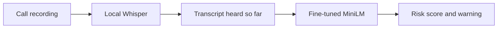

# swissscam

A local scam-call detector built for the Swisscom identity-fraud challenge.
It transcribes call recordings and warns when the conversation looks suspicious.
The demo runs locally on a Mac; integration into live smartphone calls is future work.

https://github.com/user-attachments/assets/f72413dc-fa74-44a0-893c-ee13847bffc5

## The problem

Scammers impersonate banks, police or relatives to obtain money, credentials or
account access. Fake emergencies make their requests sound urgent and credible.
We flag suspicious conversation content so the person receiving the call can
stop and verify the caller.

## How it works



Whisper produces timestamped text. Each segment reaches MiniLM only after playback
passes its end. The classifier reads the accumulated conversation, keeping the most
recent 512 tokens. Audio, transcripts and inference stay on the computer.

MiniLM was fine-tuned on 272 synthetic conversations, expanded into 1,088 partial
transcripts, plus 56 short behavior examples. All were AI-authored and labelled.
Separate validation data selected the checkpoint and warning threshold: **95/100**.
The score is not a calibrated probability. See [training data](data/scam/README.md).

The interface shows the transcript, score and risk history. Warnings leave the call
running; users can dismiss them or hang up. Transcription can lag behind playback.

## Run locally

Requires Python 3.13+, [uv](https://docs.astral.sh/uv/) and Node.js 22.12+.

```sh
uv sync --locked
npm ci
npm run build
uv run uvicorn main:app --reload
```

Open http://127.0.0.1:8000. Tap the phone notification, then **Accept** to play
the included `possible_scam.m4a` recording. Use **Add recording** to try another call.

No API key is needed for this flow. Whisper downloads its model on first use;
MiniLM's weights are included.

## Testing

| Input | Scam calls flagged | Legitimate calls flagged |
| --- | ---: | ---: |
| 40 fixed text conversations | 20/20 | 4/20 |
| 12 recordings spoken by two team members | 6/6 | 1/6 |

The text set includes 10 ordinary and 10 harder legitimate calls. Scam scenarios
follow documented fraud patterns; dialogue and labels are AI-authored. Text warnings
occurred at the annotated harmful turn. Recordings are a subset of these scenarios;
audio warning timing remains unverified.

[Validation protocol](evaluation/validation/README.md) · [Other results and limits](evaluation/README.md)

```sh
uv run python -m unittest -v
npm test
uv run python -m ml.evaluate_validation --compare evaluation/validation/baseline.json
```

Add `--audio` to include transcription checks. Reports record model/data hashes and
changed decisions. Keep these cases out of training and threshold selection.

## Improving with internal data

With permission, anonymised internal fraud cases and legitimate service calls from Swisscom could
replace synthetic examples. Human reviewers would label calls and the first harmful
request. Similar legitimate calls could help reduce false alarms. Swiss languages,
accents and transcription errors also need coverage.

## Repository

```text
backend/     API, transcription and detection
web/         React interface
ml/          Data checks, training and evaluation scripts
tests/      Python tests
data/       Training examples and demo audio
models/      Active classifier and licence
evaluation/ Test cases, recordings and reports
```
