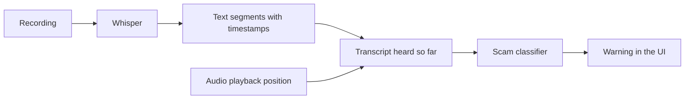

# swissscam

Local scam-call detection for the Swisscom identity-fraud hackathon. The prototype
plays English call recordings, transcribes them with Whisper and checks the
conversation for scams, including family impersonation, emergency scams and fake police.

## Run

Requires Python 3.13+, uv and Node.js 22.12+.

```sh
uv sync --locked
npm ci
npm run build
uv run uvicorn main:app --reload
```

Open http://127.0.0.1:8000. Use the demo recording or **Add recording**, then tap the
incoming-call notification and **Accept**. Transcript updates and warnings follow
playback. **End call** stops playback and discards pending results. Dismissing a
warning keeps analysis running.

No API key is needed. On first transcription, faster-whisper downloads its `base`
model; subsequent calls run locally on CPU. The scam classifier is included.
Transcription may lag behind playback, especially on the first run. The built-in
recording is short and currently does not trigger the classifier.

For frontend development, run `npm run dev` alongside the backend on port 8000.
Vite proxies API and demo-audio requests to the backend. API docs: http://127.0.0.1:8000/docs.

## Call flow



This is a recording-based call simulator, not microphone streaming. Whisper can
process ahead, but a segment reaches the classifier only after playback passes its
end timestamp. Late segments are processed in order; results from ended calls are
ignored. Failed transcription or analysis stops playback and displays an error.

| Component | File | Responsibility |
| --- | --- | --- |
| Frontend | `web/src/main.jsx` | Call screen, recording selection and results |
| Wiring | `web/src/callSession.js` | API requests, playback timing and cancellation |
| API | `main.py`, `schemas.py` | Serve the app, accept uploads and expose processing endpoints |
| Transcription | `transcription.py` | Local faster-whisper transcription with timestamps |
| Detection | `detector.py` | Classify accumulated conversation text |

`POST /api/transcribe` transcribes the built-in recording. Uploaded recordings use
`POST /api/transcribe/upload`, which streams transcript segments. The frontend
sends only heard text to `POST /api/analyze`. Model outputs replace all scripted
warnings; the UI does not display invented confidence percentages.

Run `uv run python -m unittest -v` and `npm test` for the API, classifier and playback
checks. Tests use controlled transcription fixtures; the app uses real Whisper.

## ML pipeline

The classifier uses **TF-IDF word and two-word features with logistic regression**.
It receives only the conversation text, without speaker labels or scenario metadata.

### Data and training

All conversations are synthetic. Public data comes from
[BothBosu/scam-dialogue](https://huggingface.co/datasets/BothBosu/scam-dialogue)
under Apache 2.0. The additional scenarios and their labels are assistant-authored.

| Split | Conversations | Purpose |
| --- | ---: | --- |
| Training | 1,551 cleaned public + 240 authored | Learn text patterns |
| Validation | 40 authored | Select the warning threshold |
| Test | 40 authored | Evaluate the finished model |

Related scenario pairs stay in the same split. Authored training calls produce
960 distinct partial transcripts, labelled by whether a warning is justified at
that point. A harmless opening remains negative even if the call later becomes a
scam. Public calls have only whole-call labels, so they are used in full.

Training gives partial transcripts 75% of the weight and public calls 25%, with
equal weight for positive and negative labels within each group. Validation selects
a threshold that balances scam detection and false alarms, counting premature
warnings as errors. The current threshold is **0.70**, not a calibrated probability
of fraud.

### Build and evaluate

```sh
uv run python prepare_data.py                # Clean data and check splits
uv run python train.py                       # Train and select the threshold
uv run python -m unittest -v                 # Check classifier and API
uv run python evaluate.py                    # Evaluate on test calls
```

The model is saved to `models/scam_classifier.pkl`; results go to `evaluation/`.
`detector.py` loads the model and returns `warning`, an empty `signals` list and a
general explanation. Specific scam tactics are not predicted. Restart the app after
retraining. Only load trusted pickle files.

The current synthetic test detects **19/20 scams**, with **0/20 legitimate calls
flagged** and **no premature warnings**. It misses one fake-police valuables request.
The short verification-code request in the demo recording is also missed.
This small synthetic test does not establish real-world accuracy. A call without
a warning may still be a scam. Reserve fresh test calls before further tuning.

See [data sources and labels](data/scam/README.md) and
[evaluation details](evaluation/README.md) for the full record.
