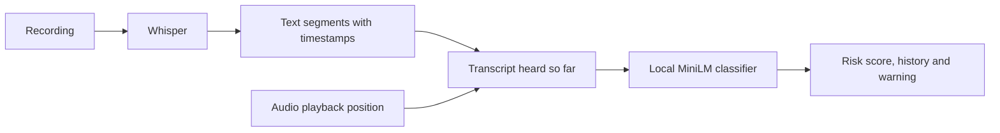

# swissscam

https://github.com/user-attachments/assets/f72413dc-fa74-44a0-893c-ee13847bffc5

##

Local scam-call detection for the Swisscom identity-fraud hackathon. The prototype
plays English call recordings, transcribes them with Whisper and checks the
conversation for scams, including family impersonation, emergency scams and fake police.

## Run

Requires Python 3.13+, uv and Node.js 22.12+.

```sh
uv sync --locked
npm ci
npm run build
uv run uvicorn main:app --reload
```

Open http://127.0.0.1:8000. Use the demo recording or **Add recording**, then tap the
incoming-call notification and **Accept**. Transcript updates and warnings follow
playback. A warning leaves playback and analysis running; dismissing it closes only
the popup. **End call** stops playback and pending analysis, keeping the transcript and results
visible. Starting another call clears them. The phone controls other than call
actions are display-only.

No API key is needed. On first transcription, faster-whisper downloads its `base`
model; subsequent calls run locally on CPU. The scam classifier is included.
Transcription may lag behind playback, especially on the first run. The built-in
recording is short and currently does not trigger the classifier.

For frontend development, run `npm run dev` alongside the backend on port 8000.
Vite proxies API and demo-audio requests to the backend. API docs: http://127.0.0.1:8000/docs.

## Demo interface

The web app shows two views side by side:

- **Call screen:** a simulated phone call with a prominent scam warning and options
  to end the call or dismiss the warning.
- **Analysis panel:** the transcript, current model score, risk history and warning
  explanation, showing what the local pipeline is doing during playback.

## Call flow



This is a recording-based call simulator, not microphone streaming. Whisper can
process ahead, but a segment reaches the classifier only after playback passes its
end timestamp. Late segments are processed in order, even after the recording
finishes. Manually ending a call discards pending results. Failed transcription or
analysis stops playback and displays an error.

| Component | File | Responsibility |
| --- | --- | --- |
| Frontend | `web/src/main.jsx` | Call screen, recording selection and results |
| Wiring | `web/src/callSession.js` | API requests, playback timing and cancellation |
| API | `main.py`, `schemas.py` | Serve the app, accept uploads and expose processing endpoints |
| Transcription | `transcription.py` | Local faster-whisper transcription with timestamps |
| Detection | `detector.py` | Classify accumulated conversation text |

`POST /api/transcribe` transcribes the built-in recording. Uploaded recordings use
`POST /api/transcribe/upload`, which streams transcript segments. The frontend
sends only heard text to `POST /api/analyze`. Model outputs replace all scripted
warnings. Call Check shows the actual model score on a 0–100 scale, the warning
threshold and a history of completed checks. Scores are not calibrated probabilities.
Whisper's [word timestamps](https://github.com/SYSTRAN/faster-whisper#word-level-timestamps)
provide roughly three-second text updates; recognition delays can still postpone them.

Run `uv run python -m unittest -v` and `npm test` for the API, classifier and playback
checks. Tests use controlled transcription fixtures; the app uses real Whisper.

## ML pipeline

The active classifier is a small **fine-tuned MiniLM text model**, running locally
on CPU. It receives the transcript heard so far, without speaker labels or scenario
metadata. It keeps the most recent 512 tokens for long calls.

Training uses 272 authored conversations (1,088 unique partial transcripts) and
56 short behavior examples covering requests, negations and reported scams. All
task-specific training examples are synthetic and assistant-labelled.

Checkpoint and threshold selection use 48 validation calls and 16 behavior texts.
A harmless opening is labelled negative even when the call later becomes a scam.
The selected warning threshold is **0.95** (95 on the UI's risk scale). Scores are
not calibrated probabilities. No thresholds were changed after the fresh tests.

### Files and commands

| File | Purpose |
| --- | --- |
| `context_model.py`, `detector.py` | Load MiniLM and return score, threshold and warning |
| `models/context/` | Active weights, tokenizer, training metadata and licence |
| `data/scam/authored.jsonl`, `data/scam/behaviors.jsonl` | Editable authored examples |
| `evaluation/` | Regression datasets and reports |

```sh
uv run python prepare_data.py       # Validate data and split boundaries
uv run python train.py              # Train a separate MiniLM candidate
uv run python evaluate.py           # Evaluate the active model on known call cases
uv run python evaluate_audio.py     # Check the two supplied recordings
uv run python evaluate_validation.py # Run the fixed 40-call validation set
```

Training writes to ignored `models/candidate/`. The active weights are included;
there is no classifier download at startup. `POST /api/analyze` returns `warning`,
`score`, `threshold`, an empty `signals` list and a general explanation. It does not
identify specific scam tactics. Restart the backend after replacing active weights.

### Results and limits

The frozen MiniLM model was adopted as the better hackathon prototype after a
fresh comparison. On 80 new synthetic calls it detects 37/40 scams at or after the
harmful request, versus 34/40 for TF-IDF. It flags 14/40 difficult legitimate calls,
versus 15/40. Both produce two premature warnings on scam calls. Both supplied
audio regressions are handled correctly by MiniLM.

On a separate external corpus, MiniLM detects 189/394 scam-labelled texts versus
108/394 for TF-IDF; both flag 1/400 legitimate texts. These are source labels on
whole texts, with some ambiguous examples and no warning-onset annotations.

**The model still makes many mistakes**, particularly on security advice and
reported scams. It failed the predeclared absolute false-alarm target; adoption is
based on comparative prototype improvement, not production readiness. Synthetic
scores do not establish real-world accuracy. No warning does not mean a safe call.

See [data and labels](data/scam/README.md) and [evaluation details](evaluation/README.md)
for external download instructions, recorded comparisons and limitations.

The [repeatable validation set](evaluation/validation/README.md) adds 40 fixed
scenarios, recording scripts and per-model reports. Its first text run detected
20/20 scams with no premature warnings and flagged 4/20 legitimate calls. The
12 team-recorded audio cases triggered warnings on 6/6 scam calls and 1/6 legitimate
calls; warning timing in those recordings remains unverified. Two original robocalls
were processed separately without fraud labels or accuracy claims.

A local Apertus second-opinion experiment did not reliably improve detection and
was removed. MiniLM remains the only scam classifier; the
[findings](evaluation/README.md#discarded-apertus-experiment-2026-09-24) are retained.
